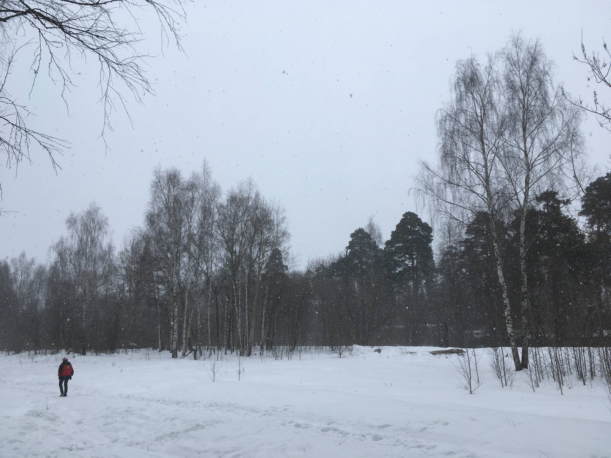

# Weather Similarity With CLIP

This project uses [OpenAI's CLIP](https://github.com/openai/CLIP) 
(Contrastive Language-Image Pre-Training) model to analyze weather conditions in images
and find similarities between weather descriptions and visual data.


## Features

- Loads and processes weather observation data from CSV files
- Extracts metadata from weather images including timestamps
- Uses CLIP to encode both weather descriptions and images
- Finds similarities between weather conditions and images
- Matches random images with most similar weather descriptions

## Data Preparation

The weather data is taken from by the weather station Moscow, Russia, WMO_ID=27612. 
These files are available at http://rp5.ru/archive.php?wmo_id=27612&lang=en,
thanks to 'Reliable Prognosis', rp5.ru, © Raspisaniye Pogodi Ltd., 2004-2024.

Weather measurements are taken five times a day, while the images are taken at random times.
This script finds the closest measurement to the picture date/time during the data preparation stage.

## Requirements

- Python 3.7+
- PyTorch
- CLIP
- Pandas
- Pillow

## Installation

1. Clone this repository
2. Install dependencies:
````bash
pip install Pillow
pip install openai-clip
````
3. Download images from Yandex Cloud https://disk.yandex.ru/d/FZwV_0HwNdCvhA
to [resources/images](resources/images)

4. Run demo code:
````bash
python main.py
```` 

## Quality

The quality of classification varies, for example, the worst case was when 
for the winter sample with much snow, the model gives a mild summer temperature: 



```
Random image: sample.jpg, description: T=-0.5, P=761.6, U=84, DD=Wind blowing from the north-northwest, Cl=Cumulonimbus calvus, with or without Cumulus, Stratocumulus or Stratus.
CLIP description: T=15.5, P=768.3, U=94, DD=Calm, no wind, Cl=nan
```